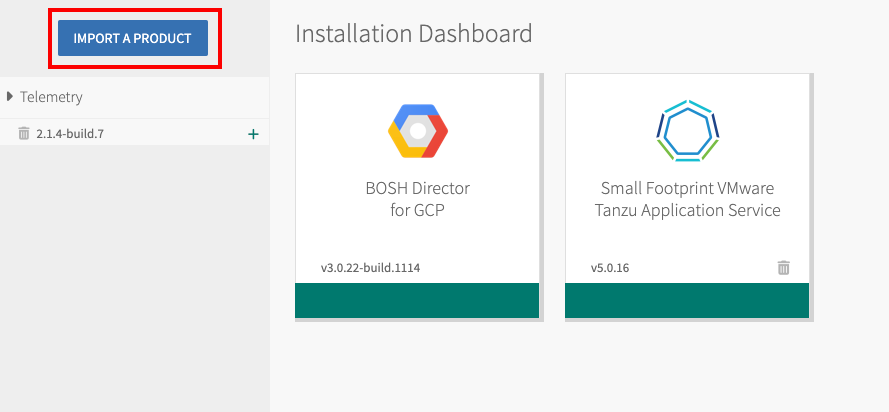
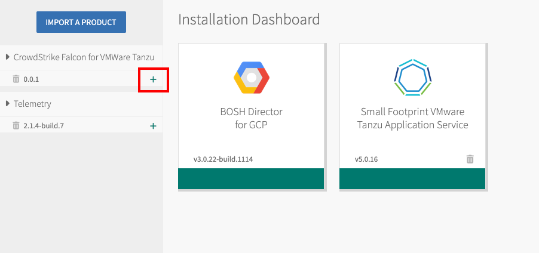
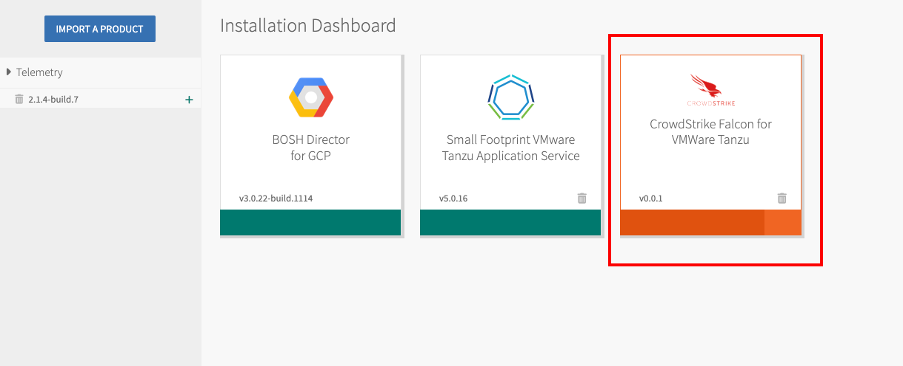
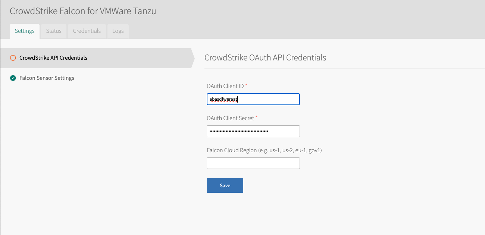
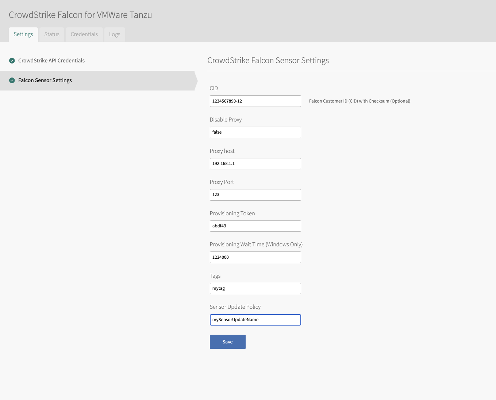

# CrowdStrike Falcon Bosh Release

The CrowdStrike Falcon Bosh Release leverages [Cloud Foundry Bosh](https://bosh.io/docs/) as an Addon to facilitate the installation of the Falcon Sensor on each Virtual Machine (VM) through the Falcon APIs. By default, the installer deployed via Bosh will handle the installation, registration of the sensor, and initiation of the service.

## Requirements

To successfully deploy the CrowdStrike Falcon Bosh Release, ensure the following prerequisites are met:

- **Access to Broadcom Portal**: You must have access to download necessary files from the Broadcom portal.
- **VMWare Tanzu Operations Manager**: Ensure you have VMWare Tanzu Operations Manager installed.
- **VMWare Tanzu Version**: The minimum supported version of VMWare Tanzu is 2.11.
- **Supported Stemcells**: Currently, only Ubuntu Stemcells are supported.
- **Proxy Configuration**: If your environment uses a proxy, it must be configured to allow the VMs to communicate with CrowdStrike's cloud. For detailed information, refer to the [Falcon Sensor for Linux System Requirements](https://falcon.crowdstrike.com/documentation/page/edd7717e/falcon-sensor-for-linux-system-requirements#l0523dcd).

## Current Limitations

It is important to note that since the Bosh job operates as an Addon rather than a deployment, uninstalling the sensor, including the `.deb` package, when the tile is uninstalled, is currently unsupported.

## Falcon API Permissions

API clients are granted specific API scopes that allow access to certain CrowdStrike APIs and define the actions that an API client can perform. Ensure the following API scopes are enabled for proper functionality:

> [!IMPORTANT]
> - **Sensor Download** [read]: This scope is essential for downloading the sensor.
> - **Sensor Update Policies** [read] (optional): This scope is required if you plan to configure the `Sensor Update Policy` via the VMWare Ops Manager UI.

## Installation

Follow these steps to install CrowdStrike Falcon in your VMWare Tanzu Application Service (TAS) environment:

1. **Download the Tile**: Obtain the CrowdStrike Falcon tile from [Broadcom's support portal](https://support.broadcom.com).

2. **Import the Tile**: Import the downloaded tile into VMWare Operations Manager.

    

3. **Add the Tile to the Dashboard**: Navigate to the VMWare Operations Manager dashboard and click the `+` button to add the `CrowdStrike Falcon for VMWare Tanzu` tile.

    

4. **Configure the Tile**: Click on the `CrowdStrike Falcon for VMWare Tanzu` product tile to begin configuring the deployment of the Bosh Addon.

    

5. **API Configuration**: Enter the required OAuth Client ID and Secret key pair generated from the CrowdStrike Falcon console. By default, the Falcon cloud region associated with your OAuth Client ID and Secret will be auto-discovered. If necessary, you can manually configure the Falcon Cloud region. Click `Save` when done.

    

6. **Optional Sensor Configuration**: If additional sensor configuration is needed, you can set the following optional settings:
   - **Falcon Customer ID (CID)**: Enter your Falcon Customer ID.
   - **Sensor Proxy Settings**: Enable or disable the sensor proxy as required.
   - **Proxy Host Configuration**: Specify the proxy host for the sensor to communicate with the Falcon cloud.
   - **Proxy Port Configuration**: Specify the proxy port for the sensor to communicate with the Falcon cloud.
   - **Provisioning Token**: Enter the provisioning token for the sensor.
   - **Tags**: Enter the provisioning token for the sensor. Any sensor tags
   - **Sensor Update Policy**: The name of the sensor update policy for the installer to get the sensor version to install specified by the sensor update policy.

    

   Once any of the optional sensor configurations have been set, click `Save`.

7. **Review Pending Changes**: In the VMWare Operations Manager Dashboard, click the `Review Pending Changes` button. This will display a list of all the changes that are queued for deployment. Ensure that the checkbox next to the `CrowdStrike Falcon for VMWare Tanzu` tile is selected. This step is crucial to confirm that the deployment process will include the Falcon sensor on each of the VMs.

8. **Apply Changes**: After ensuring that the , click the `Apply Changes` button in the VMWare Operations Manager. This action will start the deployment process of the CrowdStrike Falcon Bosh Addon to your VMs. Monitor the progress to ensure that the deployment completes successfully.

## Troubleshooting

If you encounter any issues during the deployment process, the following logs will be generated under the directory `/var/vcap/sys/log/falcon-linux-sensor/` on the VMs:

- **`pre-start.stdout.log`**: This log file captures the standard output of the pre-start script.
- **`pre-start.stderr.log`**: This log file captures the standard error output of the pre-start script.
- **`falcon-installer.log`**: This log file contains detailed information about the Falcon sensor installation process. It includes messages about the progress of the installation, any errors encountered, and other relevant details.

Review these logs for failures as to why the installation and deployment failed. When contacting CrowdStrike support, these logs should be provided.
